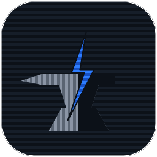
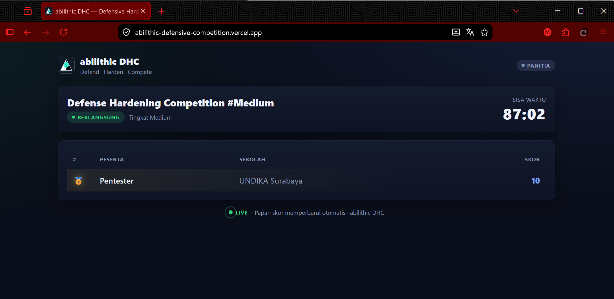
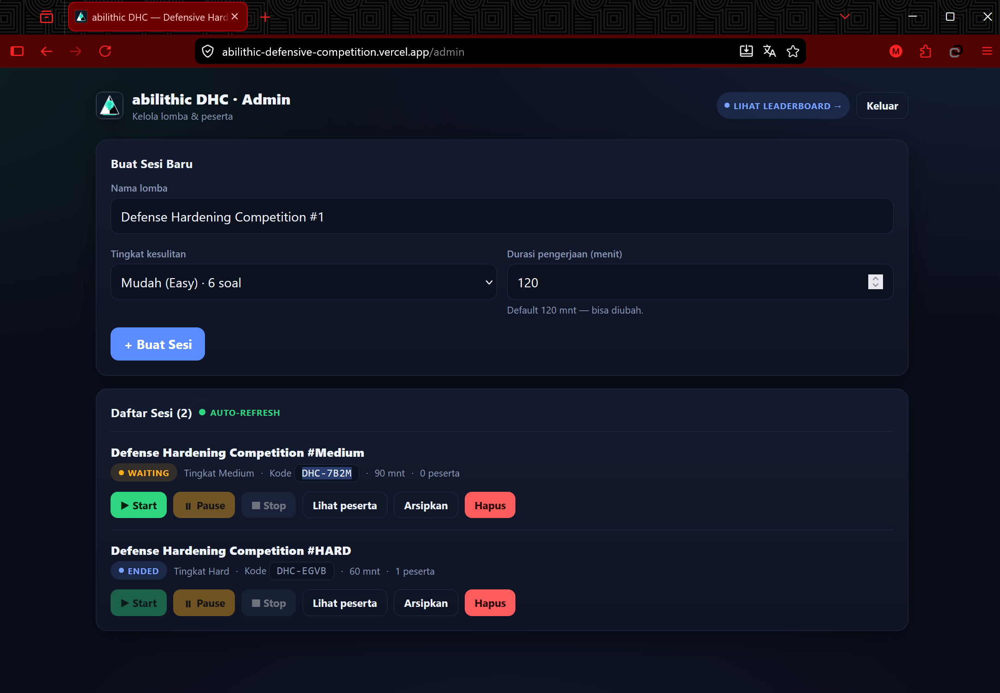
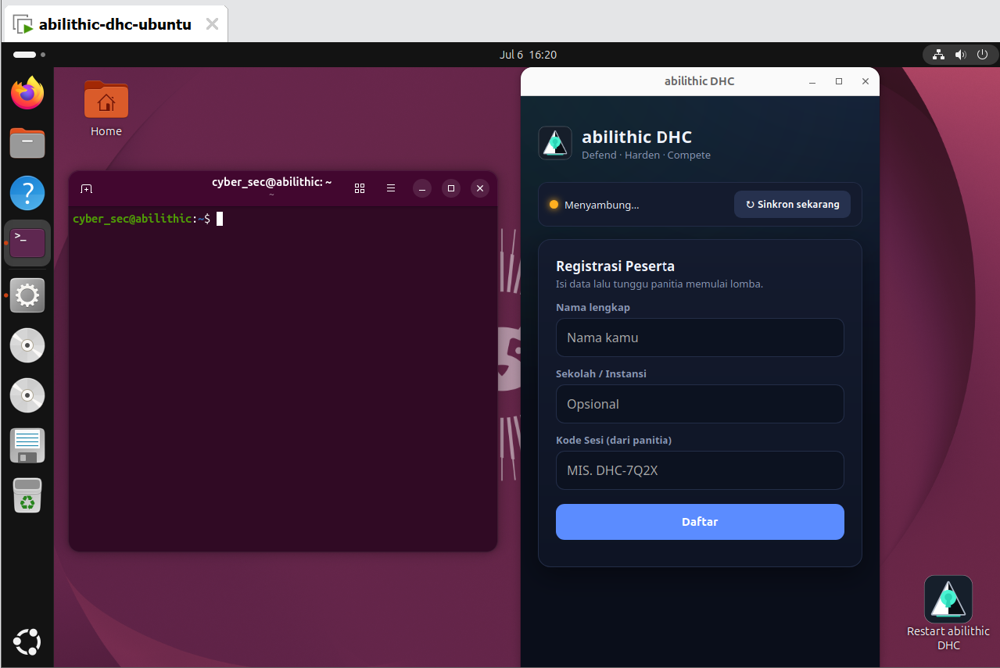
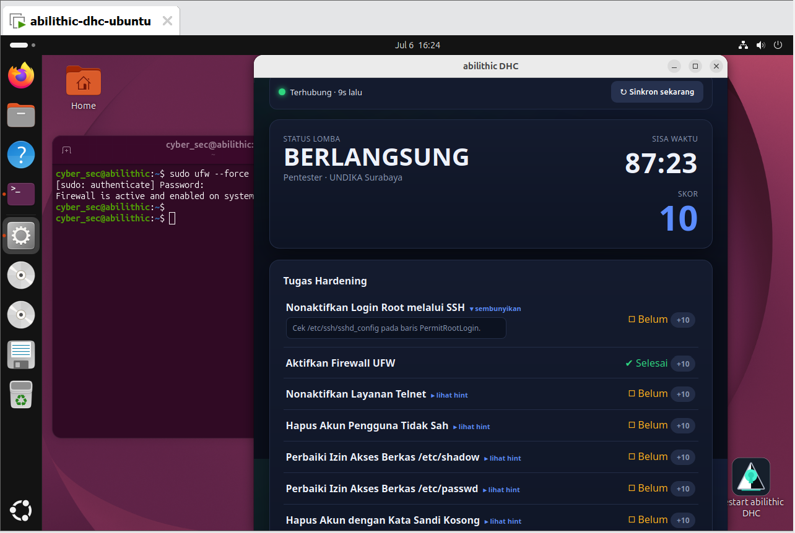

<div align="center">



# 🛡️ BlueForge

### Defensive Hardening Competition Platform — *defend the box, not just capture the flag.*

Point a class of Ubuntu VMs at a scoring server, let participants patch
real vulnerabilities under a clock, and watch the leaderboard update **live**
as each fix lands — automatically, no manual refresh, no spreadsheet grading.
Free and open source, self-hosted on Vercel + Supabase.

[](LICENSE)
[]()
[]()
[](https://vercel.com)
[](https://supabase.com)
[]()
[](https://www.linkedin.com/in/abil-khosim-itsec/)


[⬇️ Quickstart](#-quickstart) · [✨ Features](#-key-features) · [⚙️ How it works](#️-how-it-works) · [📖 Technical Design](docs/TECHNICAL-DESIGN.md) · [🧯 Troubleshooting](#-troubleshooting-organizer--participant-vm) · [⚠️ Disclaimer](DISCLAIMER.md)

</div>

---

## 🧩 The Problem

Most "cybersecurity competition" tooling is either offense-only (CTF flags,
attack ranges) or a pile of manual work for organizers: someone has to walk
around with a checklist, SSH into every VM, and grade hardening steps by
hand. Scores land minutes or hours after the fact, and participants get no
live feedback on what they've actually fixed.

**BlueForge** is a **defensive** (blue-team / system-hardening)
competition platform, closer to CyberPatriot than to a red-team CTF.
Participants receive a deliberately-vulnerable Ubuntu VM and a time limit;
every genuine fix — SSH hardened, firewall enabled, rogue accounts removed,
backdoors cleaned up — is detected automatically by a lightweight agent and
reflected on a public leaderboard within seconds, no grader required.

## ✨ Key Features

- 🎯 **Three difficulty tiers** — Easy (6 checks) · Medium (11) · Hard (15),
  picked per session by the organizer, each with its own default duration.
- ⚖️ **Fair & evidence-backed** — a Baseline & Evidence system snapshots each
  VM at registration/start/stop, so fixing a check *before* START doesn't earn
  points (closes the "pre-fix" loophole) and every score is auditable.
- ⚡ **Truly live scoring** — leaderboard polls + Supabase Realtime, admin
  console auto-refreshes participant status, and the agent's clock-skew
  correction means scores keep flowing even when a cloned VM's system clock
  is wrong (see [`docs/REVIEW-AND-CONCEPT-v2.md`](docs/REVIEW-AND-CONCEPT-v2.md) §2.1) —
  no more waiting on a manual VMware/Ubuntu clock refresh.
- 🧩 **Modular checks** — add a new hardening check by dropping a
  `manifest.yaml` + `check.py` into `agent/checks/`; the scoring engine never
  needs to change (plugin-style).
- 🖥️ **Zero-setup participant experience** — the agent ships as a kiosk
  companion app (pywebview, with a browser-kiosk fallback) that autostarts on
  VM boot: participants see registration, live score, and remaining time
  without touching a terminal.
- 🔒 **Signed, resilient networking** — HMAC-signed agent↔server traffic,
  exponential backoff, and store-and-forward queuing so a flaky network
  during a competition never silently drops a score.
- 🆓 **100% free stack** — Vercel (web) + Supabase (Postgres/Realtime/Auth) +
  a pure-Python agent. No paid services required to run a competition.

## 🖼️ Screenshots

<div align="center">

**Leaderboard** — live rank, score, and countdown, no refresh needed.



**Admin console** — create sessions, start/pause/stop, manage participants, auto-refreshing.



**Participant kiosk** — a companion window (not fullscreen-lock), so participants can
still use the terminal to work while registering and tracking their score live.




</div>

## 💻 System Requirements

| | Organizer (web) | Participant (per VM) |
|---|---|---|
| Hosting | Free Vercel + Supabase project | — |
| OS | — | Ubuntu (20.04–26.04), provisioned via `image/build/provision.sh` |
| Runtime | Node.js 20+ (dev/build only — Vercel builds in the cloud) | Python 3.10+, root access (reads `/etc/shadow` etc.) |
| Network | Public HTTPS endpoint (Vercel) | Outbound HTTPS to that endpoint — agent only *polls out*, so it works fine behind NAT |

## 🚀 Quickstart

### 1. Database (Supabase)
1. Create a free project at [supabase.com](https://supabase.com).
2. In **SQL Editor**, run `db/schema.sql`, then `db/seed/difficulties.sql`.
3. Note your **Project URL**, **anon key**, and **service_role key** (Settings → API).

### 2. Web portal (Next.js)
```bash
cd web
cp .env.example .env.local      # fill in Supabase creds + AGENT_HMAC_SECRET
npm install
npm run dev                     # http://localhost:3000
```
Deploy to Vercel: import the repo → set root directory to `web/` → fill in
the environment variables.

### 3. Agent (inside each participant's Ubuntu VM)
```bash
cd agent
cp config.example.yaml config.yaml   # set portal_url to your deployed web URL
pip install -r requirements.txt
sudo python3 main.py                 # open http://localhost:9090 to register
```
Or launch the kiosk companion app instead of the bare agent:
`python3 kiosk.py` (see [`docs/kiosk-setup.md`](docs/kiosk-setup.md) for
autostart on VM boot).

### 4. Run a competition
1. On **`/admin`**: create a session, pick a difficulty (Easy/Medium/Hard), get a **session code**.
2. Participants register at `localhost:9090` using that code.
3. Organizer clicks **START** → every agent begins scoring simultaneously → live scores on **`/`**.
4. **STOP** freezes scores → export results.

> 🧭 First time self-hosting this end-to-end (repo → Supabase → Vercel → VM)?
> See the detailed beginner walkthrough: [`docs/DEPLOYMENT-GUIDE.md`](docs/DEPLOYMENT-GUIDE.md).

## 🎛️ What Each Piece Does

| Component | What it does |
|---|---|
| `agent/` | Python agent — runs checks, computes score, signs & sends results, serves the local kiosk UI |
| `web/app/api/v1/*` | Signed agent-facing API — register, state, score, heartbeat, snapshot, clock sync |
| `web/app/page.tsx` | Public live leaderboard |
| `web/app/admin/page.tsx` | Organizer console — sessions, participants, start/pause/stop, disqualify |
| `db/` | Postgres schema + seed (difficulties, checks) + `leaderboard` view |
| `image/build/provision.sh` | Plants the 15 intentional vulnerabilities into a base Ubuntu VM |

## ⚙️ How it Works

```
[ participant VM: blueforge-agent ] --HTTPS (polling, signed)--> [ Next.js /v1 API ]
                                                                          |
                                                                   [ Supabase: Postgres + Realtime ]
                                                                          |
                                                        [ Web: live Leaderboard + Admin console ]
```

The agent sits behind NAT and only *polls out* — the server never needs to
reach into a participant's VM. Every scoring cycle: sync clock with the
server (no manual clock fixing needed) → fetch competition state → run the
active checks → compute the score (pure function, `eligible = failed at
START`) → sign and send. Full design in
[`docs/TECHNICAL-DESIGN.md`](docs/TECHNICAL-DESIGN.md).

## 🗺️ Roadmap

- **v0.2** *(current)* — 15 checks across 3 real difficulty tiers, kiosk companion app, admin auto-refresh, agent clock-skew fix.
- **v0.3** — richer plugin API for community-contributed checks, evidence viewer UI, CSV/PDF result export.
- **v0.4** — Windows participant VM support (agent port), Go rewrite of the agent for smaller footprint.
- **v1.0** — production hardening: full replay-protection, rate limiting, multi-organizer orgs.

See [`docs/V0.2-PLAN.md`](docs/V0.2-PLAN.md) and the full TDD roadmap (§29) for details.

## 🤝 Contributing & Security

Issues and PRs welcome — see [CONTRIBUTING.md](CONTRIBUTING.md). Add a new
check by subclassing the `run(ctx) -> {"passed": bool, "evidence": {...}}`
contract in `agent/checks/<code>/check.py`; the engine needs no other change.

Found a vulnerability in the platform itself (not one of the intentionally
planted training vulnerabilities)? Report it via [SECURITY.md](SECURITY.md) —
please don't open a public issue.

## 🧯 Troubleshooting (Organizer / Participant VM)

Quick reference for the two operations organizers run most often on a
participant VM. Full step-by-step (Bahasa Indonesia) lives in
[`docs/DEPLOYMENT-GUIDE.md`](docs/DEPLOYMENT-GUIDE.md#-troubleshooting).

**First run on a fresh VM clone:**
```bash
# clear shell history first — a cloned VM shouldn't leak the previous user's commands
cat /dev/null > ~/.bash_history && history -c && history -w

cd ~/BlueForge
git pull
sudo bash image/build/provision.sh   # plants the 15 intentional vulnerabilities
```

**Pulling a code update onto an already-installed VM** — the kiosk/agent
that actually runs at boot is a **separate copy** installed to
`/opt/blueforge-agent/` by `install-kiosk.sh`, not the git checkout itself.
`git pull` alone does **not** update what's running — you must resync:
```bash
cd ~/BlueForge
git pull
sudo bash agent/kiosk/install-kiosk.sh   # resyncs code into /opt + restarts the service
sudo systemctl restart blueforge-agent
```

**Kiosk window accidentally closed by a participant:** `kiosk.py` now
auto-reopens the window on its own within ~2 seconds — no action needed. If
the window is ever truly stuck, double-click the **"Restart BlueForge"**
shortcut on the Desktop (no terminal required), or run
`bash /opt/blueforge-agent/kiosk/restart-kiosk.sh`.

**Common diagnostic commands:**
```bash
systemctl status blueforge-agent dhc-telnetd   # are the services alive?
ps aux | grep -E "kiosk.py|main.py"            # is the kiosk/agent actually running?
journalctl --user -b | grep -i -E "kiosk|webview|gtk"  # kiosk autostart logs this boot
diff ~/BlueForge/agent/kiosk.py /opt/blueforge-agent/kiosk.py  # in sync?
```

## ⚠️ Disclaimer

This platform intentionally plants security vulnerabilities into VMs for
training purposes. **Isolated/air-gapped competition networks only** — see
[DISCLAIMER.md](DISCLAIMER.md) before deploying.

## 📄 License

[MIT](LICENSE) © 2026 Abil Khosim.

---

<!-- GitHub topics: cybersecurity, blue-team, ctf, cyberpatriot, defensive-security,
system-hardening, linux-hardening, security-competition, nextjs, supabase, python,
realtime, education, capture-the-flag-alternative -->

<div align="center">

### 👤 Developed by **Abil Khosim** — *Cybersecurity Specialist*

[](https://www.linkedin.com/in/abil-khosim-itsec/)

*BlueForge* is an original project by Abil Khosim, part of the **NoxNull**
toolkit (Fathom · Flare · BlueForge · Cove). Released under the MIT License —
please keep this attribution when reusing or redistributing.

<sub>Stop collecting flags. Start patching real vulnerabilities. 🛡️</sub>

</div>
