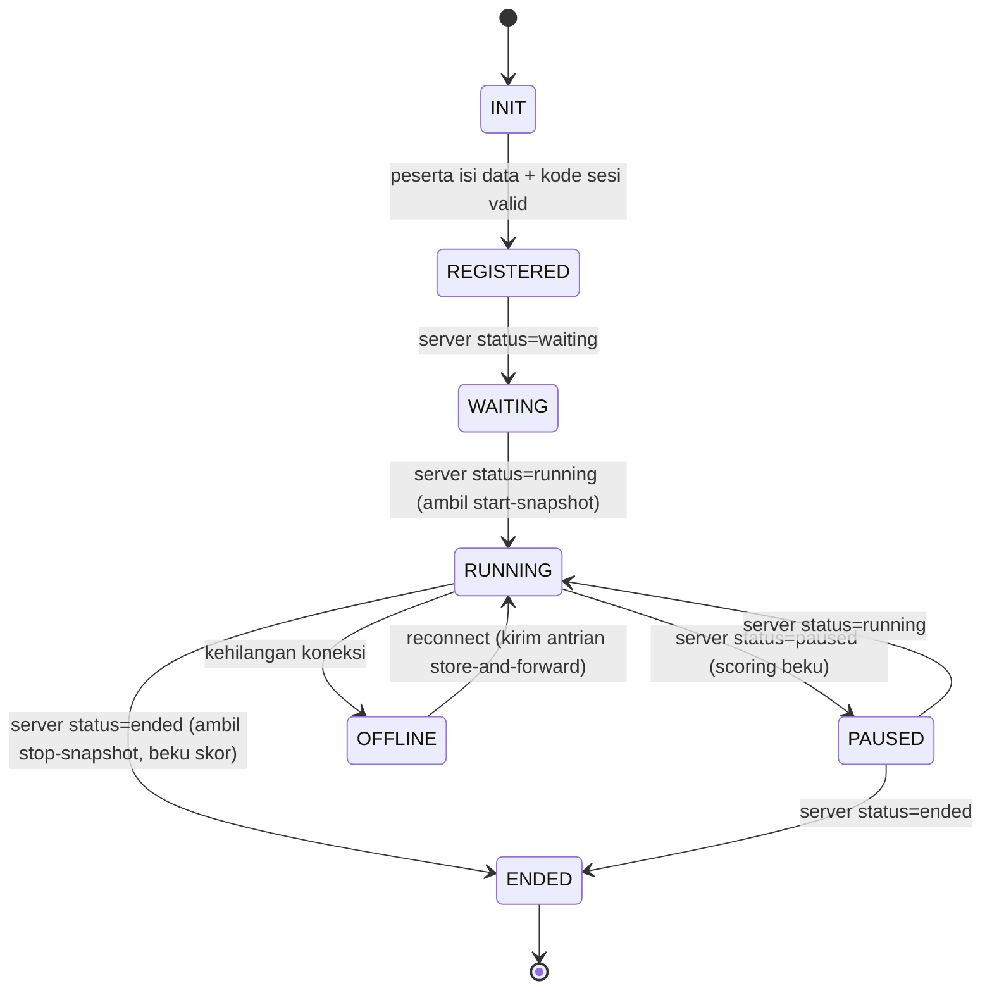
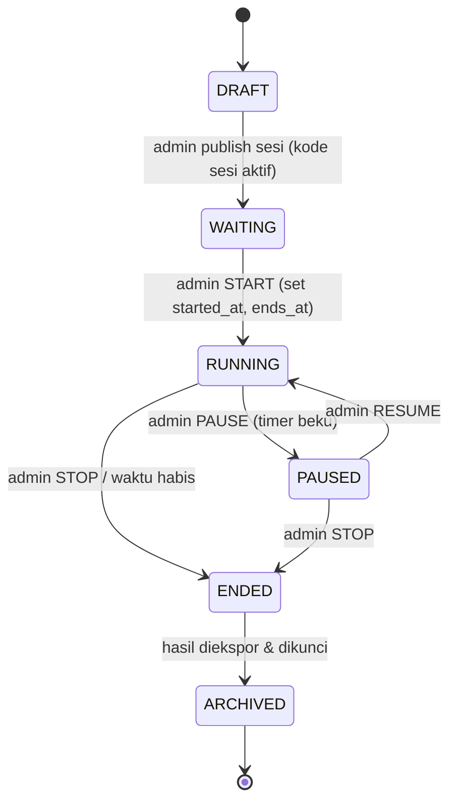
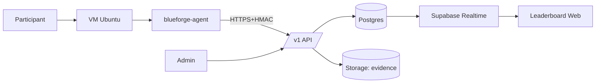
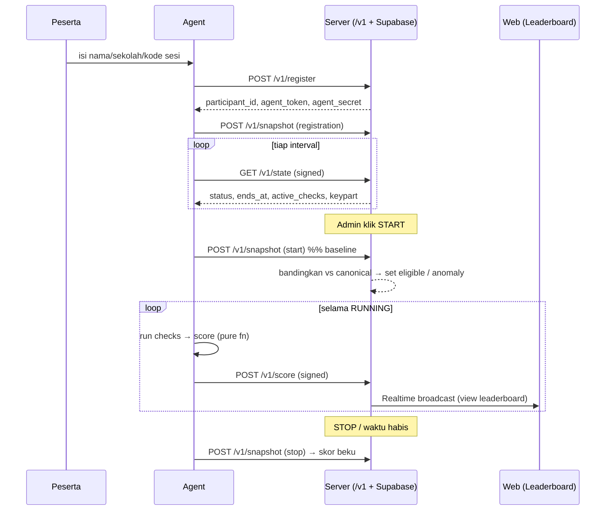
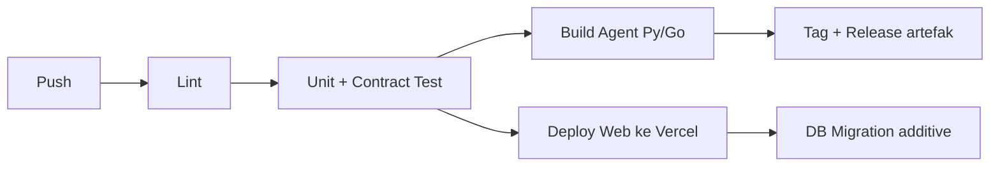
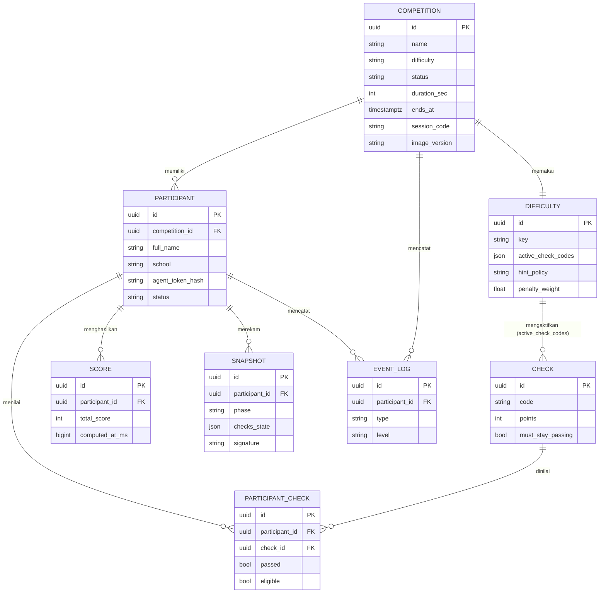

<!--
  BlueForge — Technical Design Document (FINAL, v1.0)
  Dipindahkan ke dalam repo (docs/TECHNICAL-DESIGN.md) agar benar-benar
  ter-versi & tersedia di GitHub — sebelumnya file ini hidup satu level di
  luar repo dan tidak pernah ter-upload. Isi di bawah adalah dokumen asli,
  tidak diubah kecuali catatan editorial ini. Untuk status implementasi
  terkini, port lokal, dan temuan/rencana v0.3, lihat
  ../REVIEW-AND-CONCEPT-v2.md.
-->

# BlueForge (DHC)
### Defensive Hardening Competition Platform — Technical Design Document (FINAL)

> **Repo / codename:** `BlueForge` · **Brand:** **BlueForge**
> **Tagline:** *Defend. Harden. Compete.*
> **Status dokumen:** Final konsep (v1.0) — menjadi **acuan utama** implementasi & dokumentasi open source.
> **Cakupan:** produk, arsitektur, keamanan, kontrak teknis, operasi, kualitas, tata kelola, roadmap.

---

## Daftar Isi

**Bagian I — Produk & Visi**
1. Visi & Misi · 2. Ringkasan Eksekutif & Kelayakan · 3. Prinsip Desain

**Bagian II — Arsitektur**
4. Arsitektur Sistem · 5. Tech Stack · 6. Tingkat Kesulitan (Easy/Medium/Hard)

**Bagian III — Komponen**
7. VM Image · 8. Agent (+ state machine) · 9. Web Portal

**Bagian IV — Keamanan**
10. Threat Model · 11. Security Design · 12. Answer-Key Encryption · 13. Baseline & Evidence + Snapshot Format · 14. Scoring Model

**Bagian V — Kontrak Teknis**
15. Check Plugin Architecture · 16. API Contract · 17. Error Handling & Retry · 18. State Machine Lomba · 19. Data Flow & Sequence Diagram · 20. Skema Database

**Bagian VI — Operasi & Kualitas**
21. Logging Standard · 22. Monitoring · 23. Performance & Capacity · 24. Versioning (SemVer) · 25. Testing Strategy · 26. CI/CD

**Bagian VII — Fondasi, Tata Kelola & Roadmap**
27. Kontrak Stabil (Fondasi) · 28. Repository Governance · 29. Roadmap Multi-Tahun · 30. Struktur Repo · 31. Alur Hari-H

**Bagian VIII — Implementation Blueprint (v0.1)**
32. Domain Model · 33. Database ERD · 34. Folder Architecture · 35. Arsitektur Modular Agent · 36. Prioritas Fitur (MVP/Nice/Future) · 37. Scope Keamanan MVP vs Produksi · 38. Milestone Development · 39. Risk Register · 40. Acceptance Criteria v0.1 · 41. ADR · 42. Kesimpulan & Mulai Build

---
---

# BAGIAN I — PRODUK & VISI

## 1. Visi & Misi

**Visi.** Menjadi **platform open-source Defensive Hardening Competition pertama dari Indonesia** yang dapat di-*deploy* dengan mudah oleh sekolah, kampus, komunitas, dan organisasi — mengisi celah di dunia kompetisi keamanan siber yang selama ini didominasi CTF *offensive*, dengan fokus pada sisi **blue-team / pertahanan**.

**Misi.**
- Mengajarkan **Linux hardening** dan pola pikir **blue-team** secara praktis dan terukur.
- Menyediakan kompetisi bergaya **CyberPatriot** yang **gratis, terbuka, dan mudah diselenggarakan**.
- Menurunkan hambatan teknis: cukup satu VM image + koneksi internet untuk peserta.
- Menjadi fondasi ekosistem yang bisa tumbuh: dari satu lomba sekolah hingga platform multi-organisasi.

**Nilai inti.** Adil (fair) · Transparan (skor & bukti terbuka) · Aman (anti-cheat berlapis) · Mudah (low-friction) · Berkelanjutan (fondasi stabil).

**Untuk siapa.** Peserta pelajar/umum (semua level kemampuan, lewat tingkat Mudah/Medium/Hard), panitia/guru, dan kontributor open source.

---

## 2. Ringkasan Eksekutif & Kelayakan

**BlueForge** adalah platform lomba keamanan siber **defensif (system hardening)**. Peserta menjalankan VM Ubuntu yang sengaja dibuat rentan, lalu **memperbaiki celah keamanan** dalam batas waktu. Setiap perbaikan benar otomatis menambah skor, dan skor seluruh peserta tampil **realtime** di papan skor.

**Kelayakan: SANGAT MUNGKIN & terbukti.** Modelnya identik dengan **CyberPatriot** (kompetisi hardening pelajar terbesar di AS, belasan tahun berjalan): VM di komputer peserta + agen scoring lokal + leaderboard realtime di web. Seluruh sistem dapat berjalan **100% gratis** memakai **Vercel + Supabase**, dengan agen **Python (MVP) → Go (produksi)**.

**Tiga pilar yang membuatnya profesional:**
1. **Baseline & Evidence System** (§13) — menutup celah "memperbaiki sebelum START" + bukti before/after untuk protes.
2. **Tingkat kesulitan umum Easy/Medium/Hard** (§6) — dipilih panitia per lomba, satu image untuk semua.
3. **Kontrak stabil & keamanan berlapis** (§10–11, §27) — upgrade bersifat *additive*, tak merusak fondasi.

---

## 3. Prinsip Desain (Koreksi Kunci)

**a. Defensive, bukan offensive.** Tugas peserta = mengamankan sistem, bukan meretas.

**b. Vuln *pre-baked*, portal hanya mengaktifkan.** VM peserta di balik NAT → portal tak bisa menyuntik celah. Semua celah ditanam sejak image dibuat; portal mengaktifkan **tingkat kesulitan** & sinyal START. **Agen yang menarik (polling)** perintah.

**c. "Lock/timer" = scoring window + baseline.** Penilaian dianchor ke baseline saat START, dibanding **canonical baseline** (kondisi pabrik image per tingkat). Menutup celah pre-fix tanpa mengunci OS.

**d. Realtime via Supabase, bukan WebSocket di Vercel.** Vercel free hanya serverless.

**e. Keamanan & evidence sejak desain**, bukan ditambal belakangan.

**f. Server = satu-satunya sumber kebenaran** untuk waktu & state lomba.

**g. Semua tumbuh lewat data & titik ekstensi**, inti jarang berubah (§27).

---
---

# BAGIAN II — ARSITEKTUR

## 4. Arsitektur Sistem

```
┌──────────────────────── KOMPUTER PESERTA ────────────────────────┐
│ VMware / VirtualBox                                               │
│ ┌──────────── VM Ubuntu (blueforge-image) ──────────────────────┐│
│ │ • OS sengaja rentan (canonical dirty state, terdokumentasi)   ││
│ │ • blueforge-agent (systemd, autostart)                        ││
│ │    - Registrasi peserta                                       ││
│ │    - Snapshot evidence: registration → start → stop           ││
│ │    - Loop: poll state → run checks → scoring → kirim          ││
│ │    - Mini web lokal (localhost:8080): status, hint, timer     ││
│ │ • answer-key terenkripsi (AES-GCM, split-key)                 ││
│ └───────────────────────────────────────────────────────────────┘│
└──────────────────────────│ HTTPS keluar (polling) ────────────────┘
                           ▼
┌──────────────────── SUPABASE (Gratis) ───────────────────────────┐
│ • PostgreSQL  • Realtime  • Auth  • Storage (file evidence)       │
│ • Edge Functions / REST API — versioned /v1 (agen & admin)        │
└──────────────────────────│────────────────────────────────────────┘
                           ▼
┌──────────────────── VERCEL (Gratis) ─────────────────────────────┐
│ Next.js — Halaman Peserta + Halaman Admin (+ Evidence Viewer)     │
└───────────────────────────────────────────────────────────────────┘
```

**Pola kunci:** server **tidak** menghubungi agen (karena NAT). **Agen yang rutin bertanya** ("sudah START? sisa waktu? tingkat & check aktif?") lalu mengirim skor + evidence. Lihat data flow & sequence di §19.

---

## 5. Tech Stack (Semua Gratis) + Alasan

| Lapisan | Pilihan | Alasan |
|---|---|---|
| Web Portal | **Next.js** @ **Vercel** | Gratis, deploy dari GitHub, cepat. |
| Database | **Supabase Postgres** (free 500 MB) | Cukup ratusan peserta; SQL kuat. |
| Realtime | **Supabase Realtime** | Leaderboard live tanpa server WebSocket. |
| Auth admin | **Supabase Auth (JWT)** | Login admin standar. |
| Penyimpanan evidence | **Supabase Storage** | Snapshot before/after. |
| API | **Edge Functions / Next.js API** (`/v1`) | Endpoint ber-versi untuk agen & admin. |
| Agent | **Python 3** (MVP) → **Go** (produksi) | Python cepat; Go = 1 binary anti-tamper. |
| VM | **VMware Player / VirtualBox** | Gratis; ekspor **OVA**. |
| Distribusi image | Google Drive / GitHub Releases | OVA besar (GB), tak masuk repo git. |

> **Rekomendasi final:** Vercel + Supabase + Agent Python→Go. Gratis untuk skala sekolah; pertimbangkan VPS hanya saat skala ribuan/kontrol penuh (§23).

---

## 6. Tingkat Kesulitan (Easy / Medium / Hard)

Tingkat kesulitan **bersifat umum** (bukan jenjang sekolah) dan **dipilih panitia per lomba**. Untuk lomba perdana, pilih **Easy**.

Tingkat adalah **preset** (baris `difficulties`) yang mengatur 4 hal dari data, tanpa ubah kode inti:

| Yang diatur | Easy | Medium | Hard |
|---|---|---|---|
| Jumlah & jenis check dinilai (subset dari superset image) | 5–7, dasar & jelas | 10–14, campuran | 18+, termasuk tersembunyi/berlapis |
| Hint (`hint_policy`) | `full` (eksplisit) | `limited` (umum) | `none`/minim |
| Penalti (`penalty_weight`) | 0.5 (ringan) | 1.0 (standar) | 1.5 (berat) |
| Durasi default | longgar (mis. 120 mnt) | standar (mis. 90 mnt) | ketat (mis. 60–75 mnt) |

*(angka contoh awal; semua dapat di-override panitia per sesi.)*

**Satu image untuk semua tingkat.** Image memuat **superset** seluruh celah. Saat sesi dibuat, server menyimpan `difficulty` → menentukan `active_check_codes`, `hint_policy`, `penalty_weight`, durasi. Saat START, server mengirim daftar check aktif ke agen. **Canonical baseline bersifat per-tingkat** (§13).

**Aman ke fondasi:** menambah/menyetel tingkat = ubah baris `difficulties` saja (§27).

---
---

# BAGIAN III — KOMPONEN

## 7. Komponen 1 — VM Image (`image/`)

- Ubuntu LTS (mis. 22.04) dalam **canonical dirty state**: celah terkontrol & terdokumentasi (acuan keadilan).
- `blueforge-agent` sebagai **systemd service** (autostart).
- **answer-key terenkripsi** (§12) — peserta tak bisa baca jawaban dari dalam VM.
- Mini web agen `http://localhost:8080`.
- **Versi image** (CalVer, mis. `2026.1`) + `canonical_baseline_hash` per tingkat.

**1 image, banyak peserta & semua tingkat.** Image identik; pembeda peserta = token. Pembeda kesulitan = preset tingkat (§6). Superset celah dibekukan, subset diaktifkan saat lomba.

**Contoh celah (umum):** akun tak sah, password lemah/policy mati, SSH tak aman (root login/port), UFW mati, service tak perlu (telnet/ftp), update mati/paket usang, permission file sensitif salah, layanan rentan konfigurasi default, file "malware" tiruan, audit/logging mati.

---

## 8. Komponen 2 — Agent (`agent/`)

Jantung sistem: program di dalam VM yang menjembatani VM↔portal.

### 8.1 Fungsi
- **Registrasi:** peserta isi nama/sekolah/kode sesi di `localhost:8080`. Agen ambil **registration-snapshot**.
- **Loop utama** (interval adaptif, §17): poll state → bila `RUNNING` jalankan check aktif → hitung skor vs baseline START → kirim skor → tampilkan hint/timer.
- **Timer & lock = scoring window** (server sumber waktu).
- **Evidence:** snapshot di fase registration/start/stop (§13).
- **Hint & feedback** per check sesuai `hint_policy`.

### 8.2 Agent State Machine



Aturan: di `OFFLINE`, agen tetap menjalankan check & **mengantre** skor/snapshot lokal, mengirim ulang saat `RECONNECT`. Di `PAUSED`/`WAITING`/`ENDED` **tidak** ada penambahan skor. Transisi hanya dipicu **status dari server** (sumber kebenaran).

### 8.3 Teknologi
- **MVP:** Python + systemd.
- **Produksi:** **Go** (1 binary, lebih sulit ditampering) + signing HMAC (§11).

---

## 9. Komponen 3 — Web Portal (`web/`)

### 9.1 Halaman Peserta (publik)
Beranda/panduan, aturan, jadwal · Persiapan (unduh image, VMware, panduan instalasi bergambar) · **Leaderboard realtime** (peringkat, skor live, sisa waktu) · status pribadi ringkas (opsional).

### 9.2 Halaman Admin (login JWT)
Kelola sesi (durasi, **tingkat Easy/Medium/Hard**, kode sesi) · Daftar peserta + status online (heartbeat) · **Kontrol: START / PAUSE / STOP** + countdown · **Pemantauan** (leaderboard detail, grafik progres, log, deteksi anomali) · **Evidence Viewer** (snapshot before/after per peserta — §13) · Manajemen tingkat & check · **Ekspor hasil** (CSV/PDF) · **Monitoring** (§22).

### 9.3 Realtime
Browser *subscribe* ke **view leaderboard** (bukan tabel mentah) via Supabase Realtime → update otomatis.

---
---

# BAGIAN IV — KEAMANAN

## 10. Threat Model

> Menjawab: **"Apa yang bisa diserang, dan bagaimana mitigasinya?"** Inilah peta keamanan sistem.

### 10.1 Aktor & Ancaman

| Aktor | Ancaman | Dampak |
|---|---|---|
| **Peserta (paling utama)** | Modifikasi agen; palsukan skor; baca answer-key; bypass check; curi-start (pre-fix); tampering snapshot | Kemenangan tidak adil |
| **Network attacker** | Replay request; MITM; pencurian token | Skor palsu / impersonasi |
| **Admin (insider)** | Penyalahgunaan wewenang (ubah skor, lihat jawaban) | Hilang kepercayaan |
| **Server compromise** | Akses DB/Storage | Kebocoran data & integritas |
| **Peserta lain/penonton** | Scraping data peserta | Privasi |

### 10.2 Matriks Ancaman → Mitigasi

| Ancaman | Mitigasi (lapis) |
|---|---|
| **Palsukan skor** | HMAC per-request (§11) + verifikasi server + `eligible` check + validasi anomali + verifikasi manual juara |
| **Baca answer-key** | AES-GCM split-key, key-part hanya turun saat START (§12) |
| **Bypass check** | Cross-check artefak di snapshot + verifikasi VM final juara |
| **Curi-start / pre-fix** | Baseline START vs canonical → `eligible=false` + flag anomali (§13) |
| **Tampering snapshot** | Snapshot ditandatangani HMAC + append-only + stempel waktu server |
| **Replay request** | timestamp + nonce sekali-pakai (§11) |
| **MITM** | TLS (HTTPS) + opsional certificate pinning di agen Go |
| **Token theft** | Token ber-scope & berumur (lifecycle §11), rotasi antar-musim |
| **Insider admin** | Audit log (SECURITY/AUDIT §21) + role terbatas + answer-key tak tampil ke admin biasa |
| **Server compromise** | RLS Supabase, secret di env, backup, least-privilege |

**Asumsi realistis:** agen jalan di mesin peserta → **tak bisa 100% dipercaya**. Strategi = *defense in depth* + *server-side verification* + *evidence* + *manual review* untuk peringkat atas. Cukup & profesional untuk lomba.

---

## 11. Security Design

> **Scope penting (anti over-engineering):** Bagian ini adalah desain **lengkap untuk produksi**. Untuk **v0.1 (MVP)** cukup subset ringan — **HTTPS + token + HMAC + snapshot + baseline**. Fitur berat (split-key/HKDF, certificate pinning, nonce/replay penuh, rotasi token) **ditunda ke fase produksi**. Pemetaan jelasnya di **§37**.

### 11.1 Transport
- **TLS/HTTPS wajib** (disediakan Supabase/Vercel).
- **Certificate pinning (opsional, agen Go produksi):** sematkan hash sertifikat server untuk cegah MITM via CA palsu.

### 11.2 Autentikasi
- **Admin:** Supabase Auth **JWT** (email+password, opsi 2FA).
- **Agen peserta:** saat registrasi sukses, server mengembalikan `participant_id`, `agent_token` (opaque), dan **`agent_secret`** (hanya sekali). `agent_secret` dipakai untuk menandatangani request.

### 11.3 Request Signing (anti-forge & anti-replay)
Setiap request agen menyertakan header:
```
X-Participant: <participant_id>
X-Timestamp: <unix_ms server-synced>
X-Nonce: <random 128-bit, sekali pakai>
X-Signature: HMAC-SHA256(agent_secret, method + path + body + timestamp + nonce)
```
**Verifikasi server (urut):**
1. `participant_id` dikenal & sesi aktif. 
2. **Timestamp** dalam jendela toleransi (mis. ±120 dtk) → cegah replay lama.
3. **Nonce** belum pernah dipakai (cache nonce per sesi) → cegah replay.
4. **Signature** valid (recompute HMAC) → cegah pemalsuan payload.
Gagal salah satu → tolak (lihat error §17).

### 11.4 Token Lifecycle
`agent_token`/`agent_secret`: **diterbitkan** saat registrasi → **aktif** selama sesi → **revoked** saat `ENDED` atau peserta didiskualifikasi → **dirotasi** antar-musim. Disimpan ter-hash di DB (bukan plaintext).

### 11.5 Otorisasi data (Supabase RLS)
Row-Level Security: peserta hanya boleh menulis skornya sendiri; leaderboard publik via **view** read-only; answer-key & evidence mentah hanya untuk admin berwenang.

---

## 12. Answer-Key Encryption

> **Scope:** skema split-key di bawah adalah target **produksi**. Untuk **v0.1**, cukup **answer-key tidak disertakan plaintext** (logika check di agen + ekspektasi diverifikasi server) atau AES sederhana dengan key tertanam. Split-key/HKDF menyusul (§37).

Tujuan: peserta **tak bisa membaca jawaban** dari dalam VM sebelum/selama lomba.

**Skema (split-key, defense-in-depth):**
- Answer-key (definisi check + nilai harapan) dienkripsi **AES-256-GCM** di dalam image.
- **Kunci dipecah dua bagian:**
  - `seed_embedded`: tertanam & ter-obfuscate di binary agen (Go).
  - `keypart_server`: **diturunkan server hanya saat START** (lewat `GET /v1/state` setelah running).
- Kunci final: `K = HKDF(seed_embedded ‖ keypart_server ‖ competition_id)`.
- Akibat: **sebelum START, answer-key tak bisa didekripsi** (keypart server belum ada). Setelah START pun, isi hanya dipakai agen di memori, tidak ditulis plaintext ke disk.

**Catatan jujur:** karena klien-side, ini **memperlambat & mempersulit**, bukan mustahil dibobol. Karena itu **dikombinasikan** dengan: scoring berbasis state nyata (bukan sekadar "tahu jawaban"), verifikasi server, dan **pemeriksaan VM manual** untuk juara. Untuk lomba sekolah, ini memadai.

---

## 13. Baseline & Evidence System (+ Snapshot Format)

> Menutup celah "memperbaiki sebelum START" **dan** menyediakan bukti before/after untuk protes.

### 13.1 Tiga acuan
1. **Canonical baseline (per tingkat):** kondisi pabrik image untuk check **aktif**; daftar check yang seharusnya GAGAL (tugas yang bisa diskor) + check `must_stay_passing`. Di-hash (`canonical_baseline_hash`). Sama untuk semua peserta pada sesi/tingkat sama → acuan keadilan.
2. **Snapshot peserta:** diambil agen di fase **registration → start → stop** (+ periodik opsional), ditandatangani HMAC.
3. **Scoring window:** skor hanya dihitung START–STOP.

### 13.2 Format Snapshot (JSON)
```json
{
  "schema_version": "1.0",
  "participant_id": "uuid",
  "competition_id": "uuid",
  "phase": "registration | start | stop | periodic",
  "taken_at_server_ms": 1750000000000,
  "image_version": "2026.1",
  "difficulty": "easy",
  "checks_state": [
    { "code": "ssh_root_disabled", "passed": false },
    { "code": "ufw_enabled", "passed": false }
  ],
  "artifacts": {
    "users": ["root", "student", "hacker"],
    "listening_ports": [22, 23, 80],
    "file_perms": { "/etc/shadow": "0644" },
    "config_hashes": { "/etc/ssh/sshd_config": "sha256:..." },
    "services": { "telnet": "active", "nginx": "active" },
    "packages_outdated": 12
  },
  "baseline_diff": { "deviations_from_canonical": [] },
  "signature": "HMAC-SHA256(...)"
}
```
Artefak forensik **ringan** (hash & daftar, bukan isi file penuh) → hemat storage, cukup untuk bukti.

### 13.3 Menutup pre-fix (dua mekanisme)
Saat START, server bandingkan start-snapshot vs canonical:
- **(A) Eligibility:** hanya check yang **GAGAL di start-snapshot** → `eligible=true`. Yang sudah lulus sebelum START → `eligible=false` → **tak memberi poin**. Pre-fix jadi sia-sia.
- **(B) Anomaly + evidence:** setiap deviasi dicatat `event_logs(type=anomaly)` + `baseline_diff` → tampil di Evidence Viewer sebagai bukti.

### 13.4 Bukti untuk protes
Setiap peserta punya **start-snapshot (before)** & **stop-snapshot (after)** bertanda tangan + stempel waktu server. Protes "sudah saya perbaiki tapi skor tak naik" → bandingkan before/after pada check terkait + artefak (hash config) saat STOP. Bisa diverifikasi ulang ke snapshot VM saat juri final.

### 13.5 Anti boot-fix
Registration-snapshot juga dibanding canonical. Timeline: registration → start → (periodik) → stop. Untuk lomba ketat, kode sesi dibagikan **hari-H** agar boot pertama terjadi saat sesi `WAITING`.

---

## 14. Scoring Model

```
Untuk tiap check c (yang AKTIF pada tingkat) pada peserta p:
  eligible(c) = (status c di start-snapshot == GAGAL)
  earned(c)   = points(c)                  jika eligible(c) DAN passed sekarang
              = 0                           selain itu
Penalti:
  break(c)    = -|points(c)| * penalty_weight   jika c.must_stay_passing DAN sekarang GAGAL
Skor(p) = Σ earned(c) + Σ break(c)         # hanya dihitung saat RUNNING
```
- **Pure function** `score(canonical, start_snapshot, current_state, active_checks, penalty_weight)` → deterministik, ber-unit-test (§25).
- Leaderboard menampilkan `Skor(p)` (absolut, intuitif); keadilan dijaga `eligible` + evidence.
- `penalty_weight` dari preset tingkat (§6).

---
---

# BAGIAN V — KONTRAK TEKNIS

## 15. Check Plugin Architecture

Agar celah/check baru bisa ditambah **tanpa menyentuh engine** — orang lain pun bisa membuat plugin check.

### 15.1 Struktur 1 check
```
agent/checks/ssh_root_disabled/
├── manifest.yaml
└── check.py        # (atau check.sh / modul Go) implementasi
```

### 15.2 `manifest.yaml` (kontrak deklaratif)
```yaml
code: ssh_root_disabled          # ID stabil & unik (TAK pernah diubah)
title: "Nonaktifkan SSH root login"
description: "PermitRootLogin harus 'no' di sshd_config"
points: 10
is_penalty: false
must_stay_passing: false
category: ssh
difficulty_tags: [easy, medium, hard]   # tingkat yang boleh memakai
hint_basic: "Cek /etc/ssh/sshd_config baris PermitRootLogin"
hint_advanced: "Set PermitRootLogin no lalu restart sshd"
schema_version: "1.0"
```

### 15.3 Interface check (kontrak perilaku)
Setiap check mengimplementasikan interface seragam:
```
Check:
  id()        -> string (== manifest.code)
  run()       -> { passed: bool }
  evidence()  -> { ...artefak ringan untuk snapshot }
  points()    -> int
  hint(policy)-> string | null
```
Engine agen hanya tahu interface ini; check apa pun yang patuh kontrak bisa dipasang (*plugin-style*). Penambahan check = tambah folder + daftarkan `code`; **engine tak berubah** (§27).

---

## 16. API Contract (`/v1`)

Semua endpoint **ber-versi** (`/v1`), JSON, HTTPS, dengan header signing (§11.3) untuk endpoint agen. Perubahan hanya **additive** (§27).

### 16.1 `POST /v1/register` — registrasi peserta
**Request**
```json
{ "name": "Budi", "school": "SMK 1", "session_code": "DHC-7Q2X", "image_version": "2026.1" }
```
**Response 200**
```json
{ "participant_id": "uuid", "agent_token": "opaque", "agent_secret": "once-only",
  "competition_id": "uuid", "status": "waiting" }
```
**Error:** `400` data kurang · `404` session_code salah · `409` sudah terdaftar/sesi penuh.

### 16.2 `GET /v1/state` — tarik state lomba (polling inti)
**Response 200**
```json
{ "status": "running", "server_time_ms": 1750000000000, "ends_at_ms": 1750005400000,
  "difficulty": "easy", "hint_policy": "full",
  "active_check_codes": ["ssh_root_disabled","ufw_enabled","rogue_user_removed"],
  "keypart_server": "hadir hanya saat running" }
```
**Error:** `401` signature/timestamp invalid · `409` sesi tak aktif.

### 16.3 `POST /v1/score` — kirim skor
**Request**
```json
{ "total_score": 36,
  "checks": [ { "code": "ufw_enabled", "passed": true },
              { "code": "ssh_root_disabled", "passed": false } ],
  "computed_at_ms": 1750000123000 }
```
**Response 200** `{ "accepted": true, "server_rank": 4 }`
**Error:** `401` sig invalid · `409` sesi `ended`/`waiting` (skor diabaikan) · `429` terlalu sering.

### 16.4 `POST /v1/snapshot` — kirim evidence
**Request:** objek snapshot (format §13.2). **Response 200** `{ "stored": true, "snapshot_id": "uuid" }`
**Error:** `401` · `409` fase tak sesuai · `413` payload terlalu besar.

### 16.5 `POST /v1/heartbeat` — tanda hidup
**Request** `{ "agent_version": "1.0.0", "uptime_s": 1200 }` → **200** `{ "ok": true }`.

### 16.6 Endpoint Admin (di belakang JWT, via web/Supabase)
`POST /v1/admin/competitions` (buat sesi) · `POST /v1/admin/competitions/:id/start|pause|stop` · `GET /v1/admin/participants` · `GET /v1/admin/evidence/:participant_id` · `GET /v1/admin/export`.

---

## 17. Error Handling & Retry Strategy

### 17.1 Tabel kode & perilaku agen
| Kode | Arti | Perilaku Agen |
|---|---|---|
| `200` | OK | lanjut |
| `400` | Bad request | log ERROR, **jangan** retry membabi buta; perbaiki payload |
| `401` | Token/signature invalid | refresh waktu (sinkron jam), coba ulang 1×; bila tetap → tampilkan ke peserta, henti kirim |
| `403` | Tidak berwenang | henti, log SECURITY |
| `409` | Sesi sudah ended/belum running | berhenti scoring, masuk state sesuai |
| `413` | Payload kebesar | kecilkan snapshot (artefak ringkas), retry |
| `429` | Rate limited | mundur sesuai `Retry-After`, naikkan interval |
| `5xx` | Server error/down | **store-and-forward**: simpan lokal, retry backoff |

### 17.2 Retry — exponential backoff + jitter
```
Polling/POST gagal (5xx / network):
  retry pada 5s → 10s → 20s → 40s → max 60s (+ jitter acak ±20%)
  selama OFFLINE: skor & snapshot diantre lokal (store-and-forward)
  saat RECONNECT: kirim antrian terurut (idempoten via computed_at/nonce)
```
**Idempotensi:** server menolak duplikat berdasarkan (`participant_id` + `computed_at_ms`/nonce) → kirim ulang aman. Penting karena jaringan sekolah sering tidak stabil.

---

## 18. State Machine Lomba (Server)


Hanya **server** yang mengubah state; agen & UI membacanya. `ends_at` dihitung server saat START; PAUSE menggeser `ends_at` sebesar durasi jeda.

---

## 19. Data Flow & Sequence Diagram

### 19.1 Data Flow (high level)


### 19.2 Sequence — dari registrasi sampai leaderboard


---

## 20. Skema Database (Postgres / Supabase)

```sql
-- semua tabel punya id, created_at; perubahan via MIGRATION additive (§27)

competitions ( id, name, difficulty, status,          -- difficulty: easy|medium|hard
  duration_sec, started_at, ends_at, paused_ms_total,
  session_code, image_version, canonical_baseline_hash,
  hint_policy, penalty_weight, created_at )            -- status: draft|waiting|running|paused|ended|archived

participants ( id, competition_id, full_name, school,
  agent_token_hash, agent_secret_hash, status,         -- status: registered|online|offline|disqualified
  agent_version, last_heartbeat, created_at )

difficulties ( id, key, name, description,             -- key: easy|medium|hard
  active_check_codes_json, hint_policy, penalty_weight,
  default_duration_sec, schema_version )

checks ( id, code, title, description,                 -- code stabil & unik
  points, is_penalty, must_stay_passing, category,
  hint_basic, hint_advanced, difficulty_tags_json, schema_version )

participant_checks ( id, participant_id, check_id, passed,
  scored_points, eligible, updated_at )

scores ( id, participant_id, total_score, computed_at_ms, snapshot_at )

snapshots ( id, participant_id, phase, taken_at, server_time,
  checks_state_json, artifacts_ref, baseline_diff_json, signature )  -- append-only

nonces ( participant_id, nonce, seen_at )              -- anti-replay (TTL)

event_logs ( id, participant_id, competition_id, type, level, payload_json, created_at )
```
Leaderboard = **view** read-only di atas `scores` (Realtime subscribe ke view, bukan tabel mentah).

---
---

# BAGIAN VI — OPERASI & KUALITAS

## 21. Logging Standard

**Level:** `INFO` (alur normal), `WARN` (anomali ringan/retry), `ERROR` (gagal operasi), `AUDIT` (aksi admin: start/stop/ubah skor), `SECURITY` (signature gagal, token invalid, anomaly baseline, diskualifikasi).

**Format:** terstruktur JSON, contoh:
```json
{ "ts":"2026-06-30T08:00:00Z", "level":"SECURITY", "event":"baseline_anomaly",
  "participant_id":"uuid", "competition_id":"uuid",
  "detail":{ "code":"ufw_enabled", "expected":"fail", "got":"pass" } }
```
**Aturan:** jangan log secret/answer-key; log `AUDIT`/`SECURITY` **append-only** & dipertahankan untuk forensik/sengketa. Admin dapat memfilter per level/peserta.

---

## 22. Monitoring & Observability

Dashboard admin menampilkan kesehatan lomba secara realtime:
- **Heartbeat / peserta online vs offline** (deteksi yang putus).
- **Latency** request agen & **score update delay** (waktu skor → tampil di leaderboard).
- **Agent version mismatch** (peserta pakai versi lama).
- **Anomaly feed** (baseline deviation, lonjakan skor mustahil, signature gagal).
- **Throughput** (request/detik) vs kapasitas (§23).

**Alert sederhana:** tandai merah bila peserta offline > N menit atau anomaly terdeteksi, agar panitia bertindak cepat.

---

## 23. Performance Target & Capacity Planning

**Beban dominan = polling + score POST.** Dengan interval **30 dtk** dan payload kecil:

| Peserta | Request/detik (≈2 req/30s/peserta) | Catatan |
|---|---|---|
| 100 | ~7 req/s | Sangat ringan, Supabase free aman |
| 500 | ~33 req/s | Masih wajar; pantau koneksi & Realtime |
| 1000 | ~67 req/s | Mendekati batas free tier (koneksi/Realtime) → naikkan interval ke 45–60 dtk atau pindah ke Supabase Pro/VPS |

**Strategi kapasitas:**
- Interval polling **adaptif**: longgar saat WAITING, normal saat RUNNING; naikkan otomatis bila `429`.
- Leaderboard via **view** + Realtime (hindari query berat per klien).
- Batasi ukuran snapshot (artefak ringan).
- **Target awal yang realistis: ≤300 peserta per sesi di free tier.** Di atas itu, rencanakan upgrade. Uji via **load test & competition simulation** (§25).

---

## 24. Versioning Strategy (SemVer)

Gunakan **Semantic Versioning** `MAJOR.MINOR.PATCH` untuk komponen, plus skema masing-masing:

| Artefak | Skema | Contoh | Aturan kompatibilitas |
|---|---|---|---|
| **Protocol API** | `v1`, `v2` (mayor saja) | `/v1` | Hanya additive dalam satu mayor; perubahan breaking → `/v2` berdampingan, `/v1` tetap hidup masa transisi |
| **Agent** | SemVer | `1.2.0` | MINOR/PATCH backward-compatible; MAJOR boleh breaking + bump protocol bila perlu |
| **Image** | CalVer | `2026.1` | Tiap perubahan isi → bump + simpan `canonical_baseline_hash` baru |
| **Schema (DB/manifest/snapshot)** | `schema_version` | `1.0` | Field baru opsional; jangan hapus/ubah arti lama |

**Matriks dukungan:** server mendukung **agen versi N dan N-1** dalam satu musim → peserta tak wajib re-download image di tengah lomba. Setiap rilis dicatat di `CHANGELOG.md`.

---

## 25. Testing Strategy

| Jenis | Fokus | Catatan |
|---|---|---|
| **Unit test** | **Scoring engine** (paling kritis), parsing manifest, signing/verify HMAC, eligibility | Wajib, jalan di CI |
| **Integration test** | API `/v1` ↔ DB ↔ Realtime | Pastikan kontrak JSON stabil |
| **Agent test harness** | VM uji dengan kondisi terkontrol → check menghasilkan pass/fail benar | Termasuk skenario rusak (layanan mati) |
| **API contract test** | Validasi request/response sesuai §16 | Cegah regresi kontrak |
| **Load test** | Simulasi 100/300/1000 agen polling | Validasi §23 |
| **Competition simulation (dry-run)** | Lomba penuh end-to-end: register → start → score → pause → stop → export | **Wajib sebelum event nyata** |

Target: scoring engine **100% deterministik & tertutup unit test**; kontrak API tertutup contract test.

---

## 26. CI/CD (GitHub Actions)


- **PR:** lint + unit/contract test wajib hijau sebelum merge.
- **Main:** deploy web (Vercel) + jalankan migration (additive) + build/agent release ber-tag.
- **Staging** terpisah untuk uji sebelum produksi. Secret via GitHub Actions Secrets (jangan di repo).

---
---

# BAGIAN VII — FONDASI, TATA KELOLA & ROADMAP

## 27. Kontrak Stabil (Fondasi — Agar Upgrade Tak Merusak Inti)

### 27.1 Kontrak inti (jarang berubah)
1. **Protokol Agen↔Server `/v1`** — additive-only; breaking → `/v2` berdampingan.
2. **`code` check immutable** — judul/poin/hint boleh berubah, `code` tidak.
3. **Identitas peserta immutable** (`participant_id`, token) — tak di-recycle.
4. **Server = sumber waktu & state tunggal.**
5. **Scoring = pure function** (deterministik, ber-test).
6. **Schema via migration additive** + `schema_version`.
7. **Image `image_version` + `canonical_baseline_hash` (per tingkat).**
8. **Evidence append-only & bertanda tangan.**

### 27.2 Titik ekstensi (tumbuh tanpa sentuh inti)
Tingkat baru/penyetelan = baris `difficulties` · Check/celah baru = folder plugin + `code` (§15) · Kategori OS baru (Windows/Docker) = set check baru · Multi-sesi/event = `competition_id` di semua tabel.

### 27.3 Aturan kompatibilitas
Backward-compatible (server layani agen N & N-1) · Additive-only API · Feature flag untuk fitur eksperimental · Idempoten · Fail-safe (ragu → tandai, jangan pakai).

### 27.4 Review hulu→hilir (risiko & mitigasi)
| Layer | Risiko | Mitigasi |
|---|---|---|
| Image | ganti diam-diam → baseline kacau | bump `image_version` + hash, server validasi |
| Agent | ubah format → server lama pecah | versioning + additive + uji kompatibilitas |
| Check | ganti arti `code` | `code` immutable; baru = code baru |
| API | hapus/rename field | `/v1` beku; breaking → `/v2` |
| DB | migration destruktif | additive + backup + evidence append-only |
| Scoring | logika tersebar | satu pure function ber-unit-test |
| Realtime | skema event berubah | subscribe ke **view** stabil |
| Token | bocor/recycle | scope+lifecycle+rotasi (§11) |
| Waktu | jam lokal agen | server sumber waktu |
| Evidence | bisa ditimpa | append-only + HMAC + stempel server |

---

## 28. Repository Governance (Siap Open Source)

Lengkapi repo agar kredibel & ramah kontributor:
- **`LICENSE`** — rekomendasi **MIT** atau **Apache-2.0** (Apache-2.0 bila ingin proteksi paten).
- **`CONTRIBUTING.md`** — cara setup, gaya kode, alur PR.
- **`CODE_OF_CONDUCT.md`** — Contributor Covenant.
- **`SECURITY.md`** — **Responsible Disclosure** (lapor celah ke email khusus, bukan issue publik) — penting untuk proyek security.
- **`.github/ISSUE_TEMPLATE/`** (bug, feature) & **`PULL_REQUEST_TEMPLATE.md`**.
- **`CHANGELOG.md`** — Keep a Changelog + SemVer (§24).
- **Code style & linters** ter-enforce CI.
- **`docs/roadmap.md`** publik (§29).

---

## 29. Roadmap Multi-Tahun

| Versi | Fokus |
|---|---|
| **v0.1** | MVP: Linux hardening (Easy), agen Python, leaderboard realtime, START/STOP, baseline+evidence dasar |
| **v0.2** | Tiga tingkat (Easy/Medium/Hard), hints, Evidence Viewer, anti-cheat dasar (HMAC+anomaly) |
| **v0.3** | Plugin system check (§15), skenario acak, **agen Go**, request signing penuh (nonce/replay) |
| **v0.4** | **Windows hardening** (set check baru, OS kedua) |
| **v0.5** | Tantangan **Docker/Kubernetes** hardening |
| **v1.0** | Production-ready: monitoring, load-tested, governance lengkap, dokumentasi penuh |
| **v2.0** | **Multi-tenant SaaS**, deployment cloud, ekosistem API & marketplace check |

Tiap kenaikan versi lewat **titik ekstensi** (§27) — inti tetap stabil. Mulai dari **v0.1 Easy**, buktikan, lalu tumbuh.

---

## 30. Struktur Repo GitHub (Monorepo)

```
BlueForge/
├── README.md                  # ringkasan + Visi/Misi + link TDD ini
├── LICENSE  CONTRIBUTING.md  CODE_OF_CONDUCT.md  SECURITY.md  CHANGELOG.md
├── docs/
│   ├── architecture.md        threat-model.md       api-contract.md
│   ├── security-design.md     scoring.md            difficulty.md
│   ├── snapshot-format.md     state-machines.md     stable-contracts.md
│   ├── testing.md  monitoring.md  versioning.md  roadmap.md
│   ├── domain-model.md  erd.md  folder-architecture.md  risk-register.md
│   ├── adr/                   # ADR-001..006 (§41): keputusan arsitektur
│   ├── rules-id.md            setup-participant.md
├── web/                       # Next.js (Vercel)
│   ├── app/ (peserta + admin + evidence-viewer)
│   └── lib/supabase.ts
├── agent/                     # blueforge-agent
│   ├── agent.py | /go
│   ├── engine/                # loop, state machine, scoring (pure fn), signing
│   ├── checks/<code>/manifest.yaml + check.*   # plugin-style (§15)
│   ├── snapshot/              # baseline & evidence
│   ├── local-ui/              # localhost:8080
│   └── systemd/blueforge-agent.service
├── image/
│   ├── build/                 # provisioning celah (canonical)
│   ├── canonical/             # baseline + hash (per tingkat)
│   └── README.md              # link unduh OVA (bukan OVA-nya)
├── db/
│   ├── schema.sql  seed/difficulties.sql
│   └── migrations/            # additive-only
├── tests/                     # unit, integration, contract, load, simulation
└── .github/
    ├── workflows/             # CI: lint, test, deploy, release, migration
    ├── ISSUE_TEMPLATE/        PULL_REQUEST_TEMPLATE.md
```
> OVA jangan masuk git; simpan **script build** + link unduh di `image/README.md`.

---

## 31. Alur Hari-H (Operasional)

**Sebelum:** peserta baca panduan → pasang VMware/VirtualBox → import OVA (belum dinilai).
**Hari-H:**
1. Peserta nyalakan VM + internet → buka `localhost:8080` → isi data + **kode sesi** (`POST /v1/register`; agen ambil registration-snapshot).
2. Admin verifikasi semua `online` (monitoring §22).
3. Admin **START** → server `running`, hitung `ends_at`; agen ambil **start-snapshot**, server set `eligible`/flag anomaly.
4. Agen menilai serentak; tiap loop `POST /v1/score` → Realtime → leaderboard live.
5. Peserta lihat hint/status/timer di `localhost:8080`.
6. **STOP**/waktu habis → agen ambil **stop-snapshot**, skor beku.
7. Admin tinjau evidence/anomaly → **export** → umumkan juara → sesi `archived`.

**Runbook wajib:** dry-run (competition simulation §25) H-1, cek kapasitas, siapkan jalur komunikasi peserta.

---
---

# BAGIAN VIII — IMPLEMENTATION BLUEPRINT (v0.1)

> Bagian praktis untuk **langsung mulai coding** tanpa over-engineering. Fokus: apa yang dibangun lebih dulu, batas "selesai", dan risiko operasional.

## 32. Domain Model

Entitas inti + field penting (acuan implementasi backend & agen):

| Entitas | Field penting | Catatan |
|---|---|---|
| **Competition** | id, name, difficulty, status, duration_sec, started_at, ends_at, session_code, image_version, hint_policy, penalty_weight | Satu sesi lomba |
| **Difficulty** | key(easy/medium/hard), active_check_codes[], hint_policy, penalty_weight, default_duration_sec | Preset, bukan jenjang sekolah |
| **Participant** | id, competition_id, full_name, school, agent_token, status, agent_version, last_heartbeat | 1 peserta = 1 VM |
| **Check** | code(unik, immutable), title, points, is_penalty, must_stay_passing, category, hints | Definisi celah |
| **ParticipantCheck** | participant_id, check_id, passed, eligible, scored_points | Status check per peserta |
| **Score** | participant_id, total_score, computed_at_ms | Riwayat skor (realtime) |
| **Snapshot** | participant_id, phase(reg/start/stop), checks_state, artifacts, signature | Evidence, append-only |
| **Event** | participant_id, type, level, payload | Log/audit/anomaly |
| **Session(auth)** | admin JWT (Supabase Auth) | Otorisasi admin |

Relasi ringkas: `Competition 1—N Participant`, `Competition 1—1 Difficulty`, `Participant 1—N Score/Snapshot/ParticipantCheck`, `Check N—N Difficulty` (via `active_check_codes`).

---

## 33. Database ERD



---

## 34. Folder Architecture

### 34.1 Web (`web/` — Next.js)
```
web/
├── app/                  # routes: / (peserta), /admin, /admin/evidence
├── components/           # UI reusable (LeaderboardTable, Timer, ChecklistCard)
├── hooks/                # useRealtimeScores, useCompetitionState
├── lib/                  # supabase.ts, api.ts, format.ts
├── types/                # tipe bersama (Competition, Score, ...)
└── api/                  # (opsional) Next.js API routes /v1 jika tak pakai Edge Functions
```

### 34.2 Agent (`agent/` — Python→Go), modular (lihat §35)
```
agent/
├── main.py               # entrypoint + loop
├── engine/               # state_manager, score_engine (pure fn)
├── checks/<code>/        # manifest.yaml + check.py (plugin)
├── runner/               # check_runner
├── network/              # api client + retry/backoff
├── snapshot/             # snapshot_manager (baseline & evidence)
├── crypto/               # signing HMAC (+ enkripsi answer-key)
├── logger/               # logging terstruktur
└── ui/                   # local-ui (localhost:8080)
```

---

## 35. Arsitektur Modular Agent

Agen dipecah jadi modul kecil (single-responsibility) agar mudah dikoding & diuji:

| Modul | Tanggung jawab |
|---|---|
| **State Manager** | Kelola state agent (INIT→REGISTERED→…→ENDED, §8.2), baca status server |
| **Check Runner** | Jalankan check aktif, kumpulkan hasil pass/fail + evidence |
| **Score Engine** | Hitung skor (pure function, §14) — deterministik, ber-unit-test |
| **Network Client** | HTTP ke `/v1` + retry/backoff + store-and-forward (§17) |
| **Snapshot Manager** | Ambil & kirim snapshot (registration/start/stop, §13) |
| **Crypto** | Signing HMAC request; (produksi) enkripsi answer-key |
| **Logger** | Log terstruktur (INFO/WARN/ERROR/AUDIT/SECURITY, §21) |
| **UI** | Mini web `localhost:8080`: registrasi, status, hint, timer |

Engine **tidak tahu detail tiap check** — hanya interface (§15). Tambah check ≠ ubah engine.

---

## 36. Prioritas Fitur (Anti Over-Engineering)

**✅ MVP (v0.1) — bangun ini dulu, jangan lebih:**
Register · Polling state · START/STOP · Leaderboard realtime · **5 check Linux** (`ssh_root_disabled`, `ufw_enabled`, `telnet_disabled`, `rogue_user_removed`, `shadow_perm`) · scoring sederhana · snapshot start/stop · baseline+eligible · token+HMAC dasar.

**🟡 Nice to Have (v0.2):**
Evidence Viewer · Hint berjenjang · Penalty (must_stay_passing) · Export CSV/PDF · Monitoring dashboard · PAUSE/RESUME.

**🔵 Future (v0.3+):**
Plugin marketplace check · Windows/Docker/K8s/AD · Cloud/multi-tenant SaaS · skenario acak · agen Go penuh.

> Aturan: **jangan kerjakan kolom kanan sebelum kolom kiri stabil & teruji.**

---

## 37. Scope Keamanan: MVP vs Produksi

| Aspek | v0.1 (MVP) — cukup ini | Produksi (v0.3+) |
|---|---|---|
| Transport | **HTTPS** | HTTPS + **certificate pinning** |
| Auth agen | **Token + HMAC** (sign payload) | + **nonce/timestamp replay protection penuh** |
| Token | token per peserta, revoke saat ended | + **rotasi** antar-musim, scope ketat |
| Answer-key | tak ada plaintext / AES key tertanam | **AES split-key + HKDF**, keypart saat START |
| Evidence | snapshot + baseline (HMAC sign) | + append-only ketat + verifikasi silang |

Tujuan: keamanan **memadai & adil** sejak v0.1, tanpa memperlambat pembangunan. Fitur berat menyusul saat sistem sudah terbukti jalan.

---

## 38. Milestone Development (Estimasi Mingguan)

> Estimasi solo/part-time; sesuaikan ritmemu. Tiap minggu menghasilkan sesuatu yang **bisa diuji**.

| Minggu | Target | Output teruji |
|---|---|---|
| **W1** | Supabase: `schema.sql`, migration, seed `difficulties`+5 check, Auth admin | DB siap, bisa login admin |
| **W2** | Backend API `/v1`: `register`, `state`, `score`, `heartbeat` | Endpoint jalan (uji via curl/Postman) |
| **W3** | Agent Python: register + polling + State Manager + Network Client | Agent muncul di DB, baca state |
| **W4** | Check Runner + Score Engine + 5 check Linux | Skor terhitung benar di VM uji |
| **W5** | Leaderboard realtime (web) + START/STOP admin | Skor live tampil <5 dtk |
| **W6** | Snapshot/baseline/eligible + Evidence dasar | Before/after tersimpan, pre-fix tertangani |
| **W7** | Hardening: retry/backoff, logging, dry-run simulation | Tahan jaringan jelek, lolos simulasi |
| **W8** | Polish + dokumentasi peserta + **acceptance test** (§40) | **v0.1 rilis** |

Refactor ke **Go** dilakukan **setelah** v0.1 stabil (§29 v0.3).

---

## 39. Risk Register

| Risiko | Dampak | Mitigasi |
|---|---|---|
| Supabase free limit (koneksi/Realtime) tertembus | High | Interval polling adaptif; target ≤300 peserta; siap upgrade Pro/VPS |
| Polling overload saat banyak peserta | Medium | Backoff + interval adaptif + payload kecil |
| VM/OVA corrupt saat distribusi | Medium | Sediakan **checksum (SHA256)** OVA + mirror unduh |
| Agent crash di tengah lomba | High | **systemd auto-restart** + store-and-forward (skor tak hilang) |
| Leaderboard delay | Low | Realtime retry + subscribe ke view |
| Peserta curang (palsu skor) | Medium | HMAC + eligible + anomaly + verifikasi juara |
| Jaringan sekolah putus-putus | High | Retry backoff + antrian lokal (§17) |
| Jam VM tidak sinkron | Medium | Server sumber waktu; agen sinkron `server_time` |
| Salah konfigurasi check (false pass/fail) | High | Unit test check + dry-run sebelum event |

---

## 40. Acceptance Criteria v0.1

v0.1 dianggap **SELESAI** bila semua terpenuhi:
- ☑ 10 peserta bisa **register** & semua tampil di leaderboard.
- ☑ **START** membuat semua agen mulai menilai bersamaan.
- ☑ **STOP**/waktu habis membekukan skor untuk semua.
- ☑ Skor **realtime** tampil **< 5 detik** setelah perubahan.
- ☑ **5 check** Linux memberi pass/fail yang benar (uji manual di VM).
- ☑ **Snapshot** start & stop tersimpan untuk tiap peserta.
- ☑ **Pre-fix** sebelum START tidak memberi poin (eligible bekerja).
- ☑ **Export CSV** hasil akhir berjalan.
- ☑ **Uptime** sesi **> 95%** selama dry-run (agen pulih dari putus jaringan).

---

## 41. Architecture Decision Records (ADR)

Simpan keputusan penting di `docs/adr/` agar kontributor tak bertanya ulang:

| ADR | Keputusan | Ringkas alasan |
|---|---|---|
| **ADR-001** | Supabase (bukan backend sendiri) | Gratis: Postgres+Realtime+Auth+Storage dalam satu, hemat ops |
| **ADR-002** | Polling (bukan push ke agen) | VM di balik NAT → server tak bisa hubungi agen; agen menarik state |
| **ADR-003** | Python dulu, Go untuk produksi | Python cepat untuk MVP; Go = 1 binary anti-tamper kelak |
| **ADR-004** | HMAC request signing | Cegah pemalsuan skor tanpa infrastruktur berat |
| **ADR-005** | Vuln pre-baked + baseline per tingkat | NAT + keadilan + bukti before/after |
| **ADR-006** | Vercel untuk web | Gratis, deploy dari GitHub, terpisah dari data/realtime |

Format tiap ADR: *Context → Decision → Consequences → Status*.

---
---

## 42. Kesimpulan & Mulai Build

Dokumen ini kini lengkap dari **visi → arsitektur → keamanan → kontrak teknis → operasi → blueprint implementasi**, dengan **ERD, domain model, folder architecture, modular agent, prioritas fitur, milestone mingguan, risk register, acceptance criteria, dan ADR**. Setara **Technical Design Document enterprise**, namun tetap **realistis & gratis** (Vercel + Supabase + agen Python→Go) dan **tidak over-engineered** untuk v0.1 (§36–37).

Seperti saran review: **berhenti menambah dokumen, mulai coding.** Urutan build v0.1:
1. **Database** — `schema.sql`, migration, seed `difficulties` + 5 check.
2. **Backend API** — `/v1/register`, `/state`, `/score`, `/heartbeat`.
3. **Agent Python** — register, polling, scoring sederhana.
4. **5 check Linux** — `ssh_root_disabled`, `ufw_enabled`, `telnet_disabled`, `rogue_user_removed`, `shadow_perm`.
5. **Leaderboard realtime**.
6. **Admin START/STOP**.
7. **Evidence & snapshot**.
8. **Hint & penalty** (v0.2).
9. **Refactor ke Go** setelah MVP stabil.

Tiap langkah diuji terhadap **Acceptance Criteria (§40)** sebelum lanjut. Fondasi sudah stabil (§27) — penambahan Windows/Docker/Cloud nanti tak perlu merombak inti.

*— Selesai. BlueForge · Defend. Harden. Compete. · Dokumen fondasi v0.1; status implementasi terkini ada di README.md dan REVIEW-AND-CONCEPT-v2.md.*
